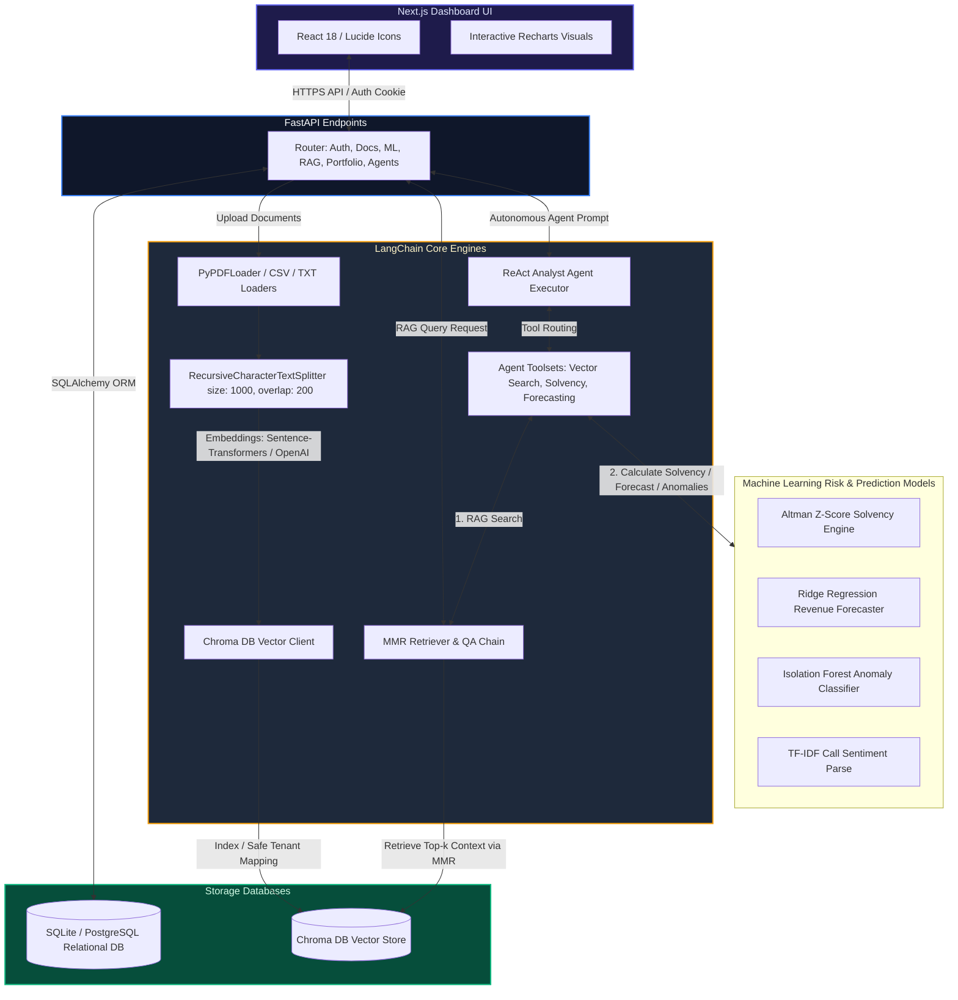

# FinSphere AI — Autonomous Financial Intelligence & Risk Decision System

FinSphere AI is an enterprise-grade financial intelligence workspace and automated risk auditing platform. Powered by high-precision LangChain ingestion pipelines, local vector databases, machine learning prediction models, and a highly resilient, autonomous conversational ReAct agent, it enables financial analysts to securely upload reports, predict revenue trends, check corporate solvency, detect accounting anomalies, and audit executive calls.

The user interface features a premium dark-mode glassmorphic theme designed to translate complex quantitative equations into clear, plain-language business insights.

---

## System Architecture

The following diagram illustrates how the frontend dashboard, FastAPI server, machine learning engines, and LangChain pipelines orchestrate to deliver grounded financial analysis:



---

## Core Workspace Features

*   **Ingested Reports Vault**: Upload PDF annual disclosures, CSV sheets, or TXT transcribing records. Files are automatically cleaned, parsed, and indexed into secure vector search spaces.
*   **AI Financial Copilot**: A conversational search assistant that references your uploaded filings. Displays a collapsible "Thinking Process" log detailing each step, from mathematical evaluation to retrieved data sources.
*   **Business Health Checker**: Computes bankruptcy risk probabilities and corporate stability tiers using historical accounting variables and Altman Z-Score coefficients.
*   **Future Revenue Predictor**: Evaluates time-series trends using Ridge regression to forecast next-quarter metrics, rendering an interactive gradient area chart.
*   **Accounting Error Detector**: Audits margin, asset, and leverage structures using an Isolation Forest anomaly classifier to isolate reporting outliers or numerical imbalances.
*   **Smart Asset Allocator**: Dynamically generates risk-adjusted portfolio weights aligned with Conservative, Balanced, or Aggressive targets.
*   **Transcript Tone Scan**: Performs natural language sentiment parses on executive transcripts, highlighting management confidence blocks, commitments, and threat warnings.

---

## Advanced Autonomous Analyst Agent

The highlight of the FinSphere AI platform is its **Autonomous Analyst Agent**, engineered using a custom LangChain ReAct (Reasoning and Action) execution loop. Unlike traditional single-prompt retrieval chains, the analyst agent operates as an intelligent workspace coordinator:

### 1. Multi-Model API Resilience & Automatic Fallback
To solve API reliability issues (such as `503 Service Unavailable` due to high demand or `429 Quota Exceeded` errors), the agent implements a sequenced fallback pool:
- **Fallback Models**: Sequentially queries `gemini-2.5-flash`, `gemini-2.5-flash-lite`, `gemini-3.1-flash-lite`, and `gemini-3.5-flash`.
- **Transient Error Retry Loop**: Catches temporary status codes, automatically waiting and retrying each model before falling back to the next model in the pool.
- **Local Sandbox Fallback**: If all external models fail or are unconfigured, the system automatically routes to a local offline rule-based semantic parser, preserving base-level functionality without breaking the workspace.

### 2. Intelligent Tool Orchestration & Selective Routing
The agent uses LangChain's decorator bindings to coordinate native Python mathematical engines and vector retrieval tasks:
- **Conditional Triggering**: Rather than executing calculations blindly, the agent routes queries dynamically. It runs specialized mathematical models (e.g., Altman Z-Score, Isolation Forest anomaly checks, Ridge regression forecast) only when the user explicitly requests calculations or forecasts.
- **Natural Language Pre-processing**: Instantly intercepts conversational greetings (e.g., "Hi", "Hello") at the agent boundary, avoiding unnecessary backend validation loops or model latency.
- **Context Synthesis**: Melds RAG retrieval outputs with quantitative machine learning diagnostics, producing direct, concise, and audit-ready reports without boilerplate text or disclaimers.

---

## LangChain Integration Deep Dive

FinSphere AI relies on the LangChain ecosystem to construct its intelligent document loaders, chunking mechanisms, semantic search models, and the conversational ReAct agent. Below is an overview of how each LangChain component is implemented in the backend codebase:

### 1. High-Precision Ingestion Pipeline
- **Document Loaders (`PyPDFLoader`)**: When a PDF report is ingested, LangChain's native `PyPDFLoader` parses formatting headers and pages, maintaining structure for complex balance sheets.
- **Smart Partitioning (`RecursiveCharacterTextSplitter`)**: Financial reports contain tightly structured tables, mathematical footnotes, and narrative blocks. We configure a custom text splitter:
  ```python
  text_splitter = RecursiveCharacterTextSplitter(
      chunk_size=1000,
      chunk_overlap=200,
      separators=["\n\n", "\n", " ", ""]
  )
  ```
  This preserves raw data structures by splitting on double newlines (paragraphs) and single newlines (table rows) first, preventing numbers from getting clipped.
- **Security Context Scope Injection**: To guarantee strict data separation in a multi-user workspace, every chunk is annotated with metadata before being written to Chroma:
  ```python
  chunk.metadata["user_id"] = user_id
  chunk.metadata["document_id"] = doc_id
  chunk.metadata["source"] = orig_filename
  ```

### 2. Embeddings & Vector Indexing (`Chroma`)
- **Dual-Model Support**: The system dynamically handles embeddings based on the environment:
  - **Cloud Mode**: Uses high-dimensional `OpenAIEmbeddings`.
  - **Local Sandbox Mode**: Instantiates local, offline CPU/GPU embeddings using `HuggingFaceEmbeddings` and the `sentence-transformers/all-MiniLM-L6-v2` model.
- **Persistent Storage**: Indexes are written to a persistent Chroma database client wrapper (`Chroma` and `chromadb.PersistentClient`) to ensure data is retained across server reboots.

### 3. Precision RAG Retrieval Network
- **Tenant Isolation Filtering**: When queries are processed, a metadata filter is combined with the retrieval arguments to restrict search scope solely to the active user's documents:
  ```python
  search_filter = {"user_id": user_id}
  ```
- **Maximum Marginal Relevance (MMR)**: To avoid duplicate information, retrieval is optimized using MMR:
  ```python
  retriever = vector_store.as_retriever(
      search_type="mmr",
      search_kwargs={"k": 4, "fetch_k": 15, "filter": search_filter}
  )
  ```
  This fetches 15 potential candidate blocks, then selects the top 4 that offer the most diverse and distinct quantitative findings.
- **Anti-Hallucination QA Prompts**: Context is fed into a structured prompt that mandates source citing and strict adherence to retrieved text:
  ```markdown
  Rules for analysis:
  1. Ground your response STRICTLY on the retrieved context above. Do not assume or project data.
  2. If the context does not contain the answer, state: "I cannot find sufficient information..."
  3. Cite your sources directly using filenames and page indices (e.g. "[Source: report.pdf]").
  ```

### 4. Autonomous ReAct Agent & Tool Binding
- **Tool Decoration (`@tool`)**: In `app/agents/tools.py`, LangChain `@tool` decorators convert native Python methods into mathematical and retrieval functions that the agent can execute.
  - `financial_vector_search`: Fetches grounded data from the vector index.
  - `ratio_calculator`: Runs the Altman Z solvency engine.
  - `revenue_forecaster`: Forecasts growth using Ridge regression.
  - `anomaly_detector`: Runs Isolation Forest checks.
- **Agent Coordinator (`create_openai_tools_agent`)**: Orchestrates the agent using an OpenAI tools prompt:
  ```python
  agent = create_openai_tools_agent(llm, self.tools, prompt)
  executor = AgentExecutor(agent=agent, tools=self.tools, verbose=True)
  ```
  This creates an autonomous feedback loop: the agent reads the user's prompt, decides which tool to run, fetches the numbers, executes the ML model, and outputs a structured SWOT report.

---

## Technology Stack

### Backend
*   **Web Framework**: FastAPI (Python 3.11) - Asynchronous, high-throughput endpoints.
*   **Agent & RAG Orchestration**: LangChain, LangChain-Community, LangChain-OpenAI.
*   **Vector Search**: ChromaDB local vector store index.
*   **ML Engines**: Scikit-Learn (Ridge regression, Isolation Forest anomalies) & custom TF-IDF Call sentiment parsing.
*   **Relational Database**: SQLite (Development) / PostgreSQL (Production) using SQLAlchemy ORM.

### Frontend
*   **Framework**: Next.js 14 (App Router) & React 18.
*   **Styles & Theme**: Vanilla CSS and Tailwind CSS (glassmorphic visual filters, radial glow rings).
*   **Interactive Visuals**: Recharts (smooth linear area graphs, asset allocation donut charts).
*   **Icons**: Lucide Icons.

---

## Repository Layout

```text
FinSphere-AI/
├── backend/                       # FASTAPI Python Backend
│   ├── app/
│   │   ├── agents/                # LangChain Autonomous ReAct Agents & Custom Tools
│   │   │   ├── analyst_agent.py   # Agent Executor & Fallback Routers
│   │   │   └── tools.py           # `@tool` Decorated Math and Search Connectors
│   │   ├── core/                  # Configurations, Database Sessions & Exceptions
│   │   ├── ml/                    # Predictive Models & NLP Sentiment Parsers
│   │   ├── rag/                   # LangChain Vector DB Setup & RAG Pipelines
│   │   ├── services/              # Ingestion Services (`PyPDFLoader` & Splitters)
│   │   └── main.py                # FastAPI App Entrypoint
│   ├── Dockerfile
│   ├── requirements.txt           # Python Requirements (FastAPI, LangChain, Scikit-Learn)
│   └── run_diagnostics.py         # End-to-End Enterprise Diagnostic Test Suite
│
├── frontend/                      # NEXT.JS 14 App Client
│   ├── app/                       # App Router & View Layouts
│   ├── components/                # Glassmorphic Workspace Dashboard components
│   ├── services/                  # Client-side API Connections
│   ├── package.json
│   └── tailwind.config.js
│
├── docker-compose.yml             # Local Container Orchestration Setup
└── README.md                      # System Documentation
```

---

## Configuration & Environment Setup

The system works out-of-the-box in local fallback sandbox mode. To enable dynamic AI-powered audits and real-time reasoning, create a `.env` file inside the root folder using `.env.example` as a blueprint:

```env
# Relational Database connection
DATABASE_URL="sqlite:////Users/sathvikgattu/.gemini/antigravity-ide/scratch/finsphere-ai/database.db"

# Vector Database local persistence path
CHROMA_PERSIST_DIRECTORY="/Users/sathvikgattu/.gemini/antigravity-ide/scratch/finsphere-ai/chroma_db"

# Reasoning API Keys (Configure one of the following for real-time AI)
OPENAI_API_KEY="your-openai-api-key-here"
GEMINI_API_KEY="your-gemini-api-key-here"
```

---

## Local Development Startup

### 1. Boot up the Backend Server
```bash
# Navigate to backend directory
cd backend

# Install python dependencies
pip install -r requirements.txt

# Run the Uvicorn application server
python3 -m uvicorn app.main:app --host 127.0.0.1 --port 8000
```
*API Endpoint Doc pages will be available at:* `http://127.0.0.1:8000/docs`

### 2. Boot up the Frontend UI Client
```bash
# Navigate to frontend directory
cd frontend

# Install packages
npm install

# Clear Next.js cache and start development server
rm -rf .next
npm run dev
```
*Open and view the application dashboard at:* `http://localhost:3000`

---

## Enterprise Verification & Diagnostics

To run the offline system diagnostics and check the integrity of all database routes, ML classifiers, and RAG pipelines:

```bash
cd backend
python3 run_diagnostics.py
```
*A successful sweep will output:* `FinSphere AI Platform — Enterprise Diagnostics successfully completed!`
